# AI修复老照片计算巢快速部署

>**免责声明：**本服务由第三方提供，我们尽力确保其安全性、准确性和可靠性，但无法保证其完全免于故障、中断、错误或攻击。因此，本公司在此声明：对于本服务的内容、准确性、完整性、可靠性、适用性以及及时性不作任何陈述、保证或承诺，不对您使用本服务所产生的任何直接或间接的损失或损害承担任何责任；对于您通过本服务访问的第三方网站、应用程序、产品和服务，不对其内容、准确性、完整性、可靠性、适用性以及及时性承担任何责任，您应自行承担使用后果产生的风险和责任；对于因您使用本服务而产生的任何损失、损害，包括但不限于直接损失、间接损失、利润损失、商誉损失、数据损失或其他经济损失，不承担任何责任，即使本公司事先已被告知可能存在此类损失或损害的可能性；我们保留不时修改本声明的权利，因此请您在使用本服务前定期检查本声明。如果您对本声明或本服务存在任何问题或疑问，请联系我们。

## 概述
只需选取一张老照片，即可一键修复，用AI唤醒老照片里的记忆。

## 部署流程
### 创建实例
访问计算巢[实例购买页](https://computenest.console.aliyun.com/user/cn-hangzhou/serviceInstanceCreate?ServiceId=service-e7c367e23b2a470aab26)，创建AI修复老照片社区版实例。

#### 选择所需地域:
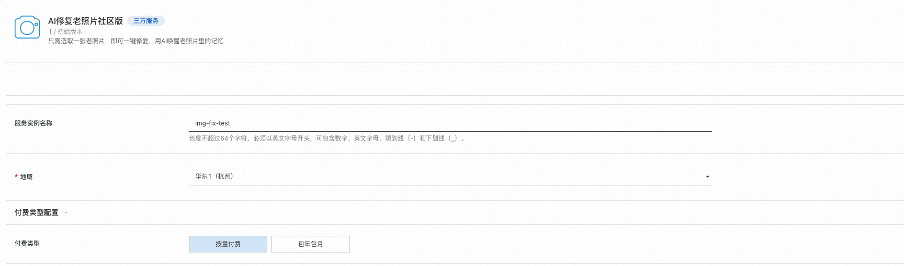

#### 选择实例类型:
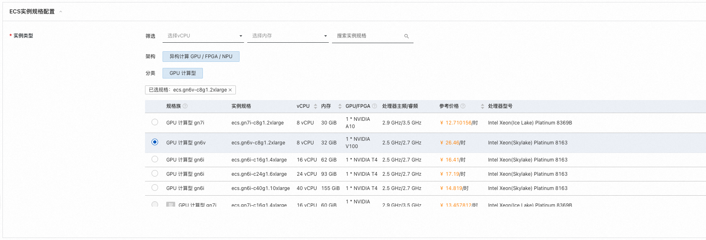

#### 选择可用区:
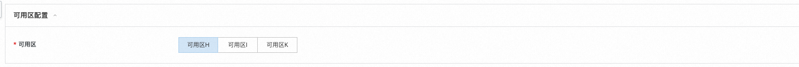

#### 选择VPC和交换机(也可以选择新建VPC):
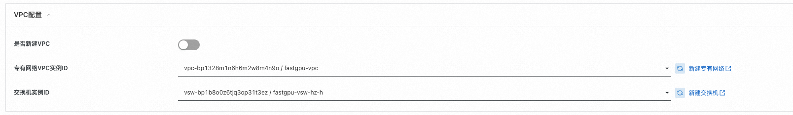

#### 设置实例密码:
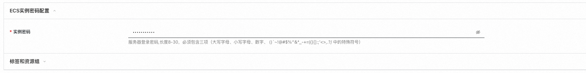

#### 点击下一步:确认订单:

#### 确认订单参数，并勾选服务条款，点击立即创建:
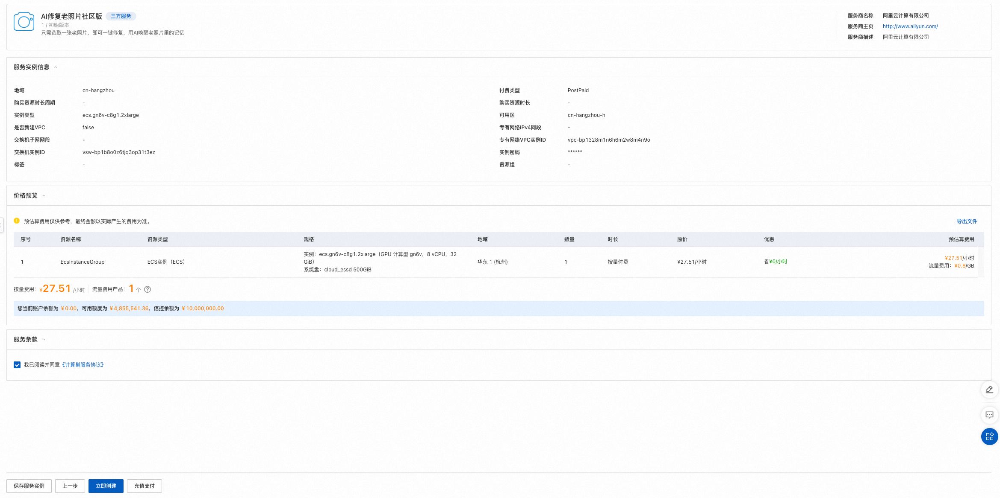

#### 点击去列表查看:
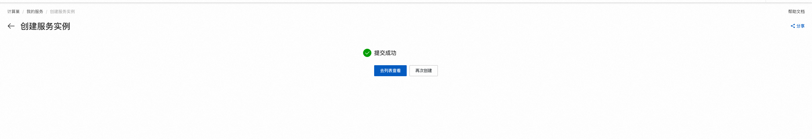

#### 稍等片刻，等待部署完成:
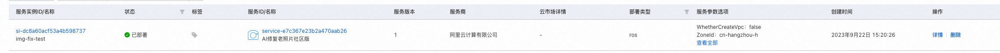

## 执行图片修复测试

### 登录页面

#### 点击计算巢控制台中的实例:
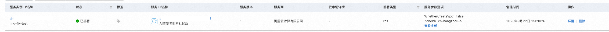

#### 点击其中的endpoint网址，进入测试页面:
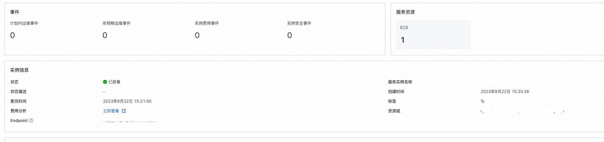

### 测试
#### 点击上传按钮上传需要修复的图片:
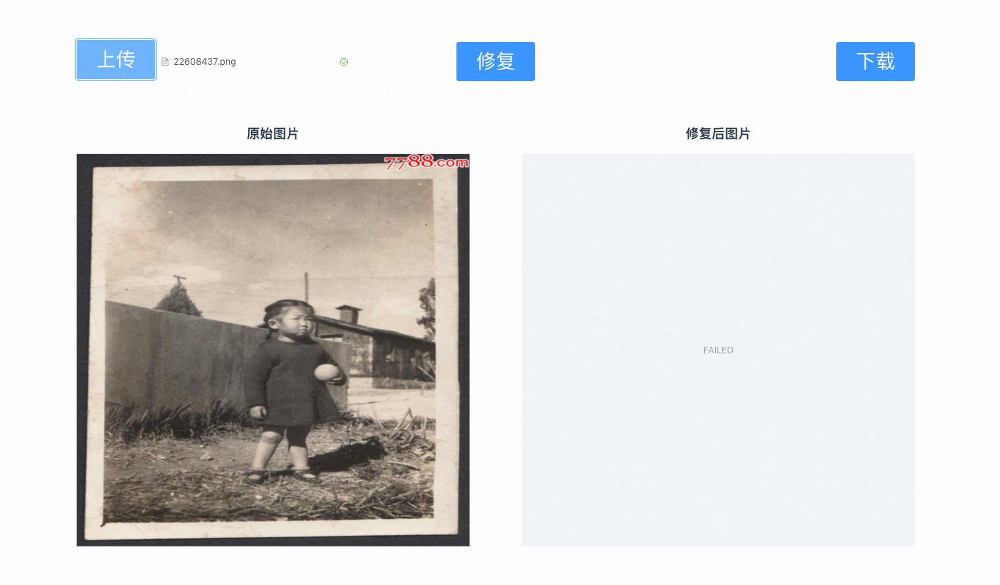

#### 点击修复按钮，进行图片修复:
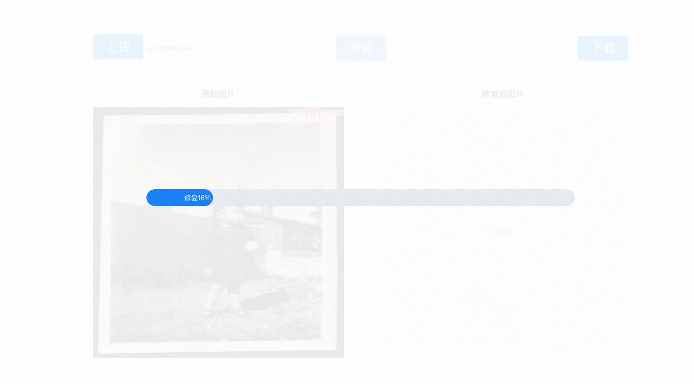
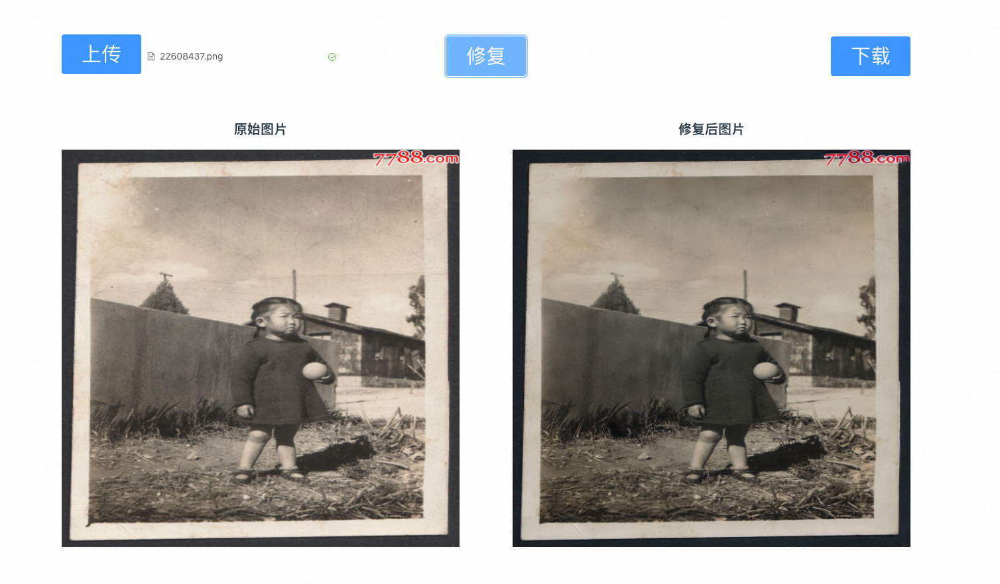

#### 点击下载按钮可以将修复后的图片下载到本地
